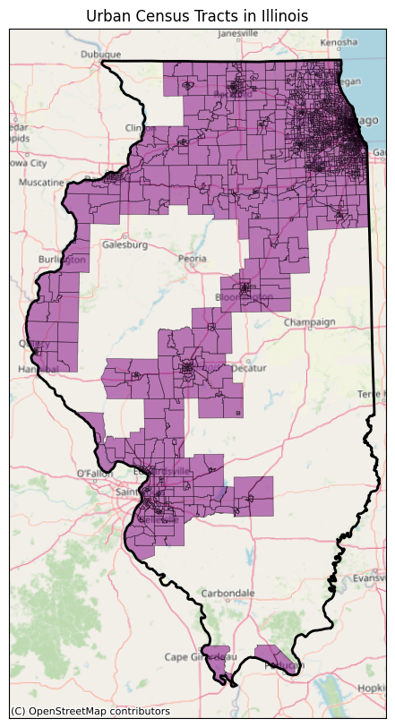
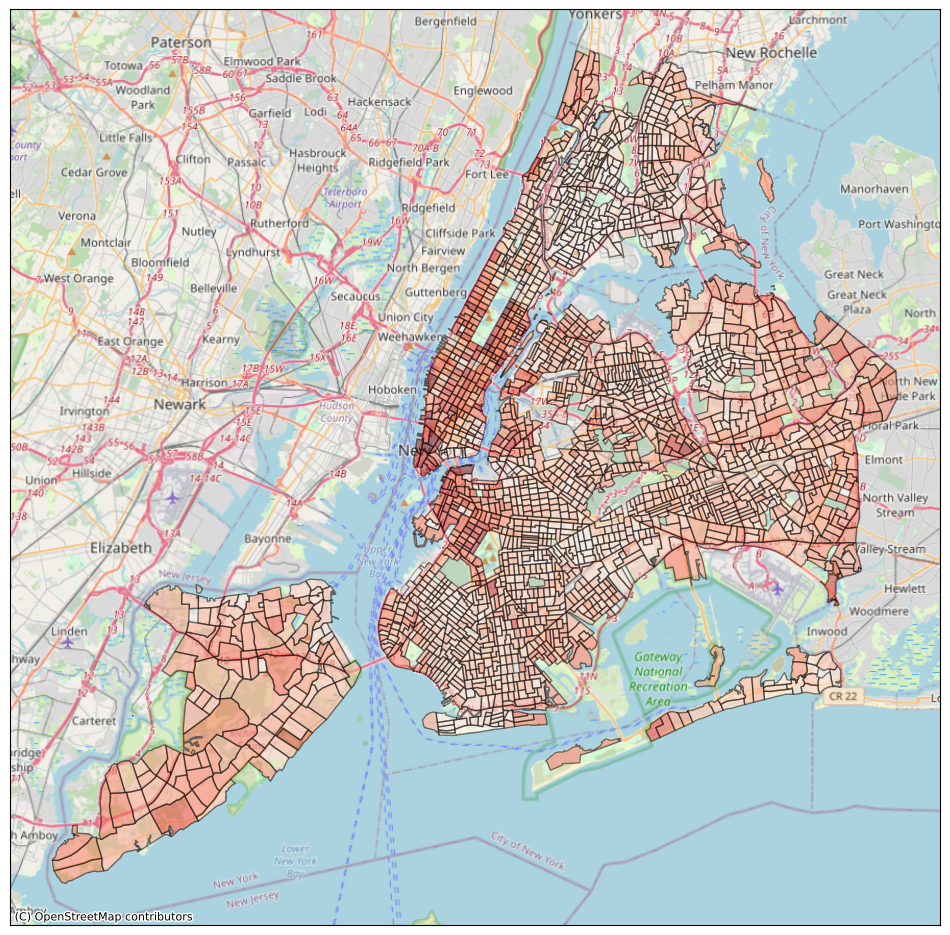

# censusdis

[](https://firstdonoharm.dev/version/3/0/cl-eco-extr-ffd-law-mil-sv.html)


[](https://censusdis.github.io/censusdis/)
[](https://censusdis.github.io/censusdis/)
[](https://censusdis.readthedocs.io/en/latest/?badge=latest)

`censusdis` is a package for discovering, loading, analyzing, and computing diversity, integration, and segregation metrics to U.S. Census demographic data. 
It is designed

- to support **every dataset**, **every geography, and every year**. It's not just about ACS data through the last time the software
was updated and released;
- to support **all geographies, on and off-spine**, not just states, counties, and census tracts;
- to have **integrated mapping capabilities** that save you time and extra coding;
- to be intuitive, Pythonic, and fast.

Click any of the thumbnails below to see the notebook that generated it.

[](../notebooks/ACS%20Demo.ipynb)
[](../notebooks/Data%20With%20Geometry.ipynb)
[](../notebooks/Nationwide%20Diversity%20and%20Integration.ipynb)
[](../notebooks/Seeing%20White.ipynb)
[](../notebooks/Geographies%20Contained%20within%20Geographies.ipynb)
[](../notebooks/Remove%20Water.ipynb)
[](../notebooks/SoMa%20DIS%20Demo.ipynb)
[](../notebooks/PUMS%20Demo.ipynb)

## Installation and First Example

censusdis can be installed with `pip`:

```shell
pip install censusdis
```

Every censusdis query needs four things:

1. What data set we want to query.
2. What vintage, or year.
3. What variables.
4. What geographies.

Here is an example of how we can use censusdis to download data once we know
those four things.

```python
import censusdis.data as ced
from censusdis.datasets import ACS5
from censusdis import states

df_median_income = ced.download(
    # Data set: American Community Survey 5-Year
    dataset=ACS5,
    
    # Vintage: 2022
    vintage=2022, 
    
    # Variable: median household income
    download_variables=['NAME', 'B19013_001E'], 
    
    # Geography: All counties in New Jersey.
    state=states.NJ,
    county='*'
)
```

There are many more examples in the tuturial and in the sample notebooks.

## Tutorial (A Great Place to Start!)

We presented a [half-day tutorial](https://cfp.scipy.org/2024/talk/BTG9U3/) 
on `censusdis` at [SciPy '24](https://www.scipy2024.scipy.org/). All the 
material covered in the tutorial is available as in a github repo at
https://github.com/censusdis/censusdis-tutorial-2024.
The tutorial consists of a series of five lessons, 
each with worked exercises, and two choices for a final project. If you 
really want to learn the ins and outs of what `censusdis` can do, from the
most basic queries all the way through some relatively advanced topics, this
is the tutorial for you.


### An Older Tutorial

For an older tutorial that is shorter but does not include some of the newest features, 
please see the [censusdis-tutorial](https://github.com/vengroff/censusdis-tutorial) repository.
This tutorial was presented at [PyData Seattle 2023](https://pydata.org/seattle2023/). If you want to try it out for yourself, the README.md
contains links that let you run the tutorial notebooks live on [mybinder.org](https://mybinder.org/) in your browser without needing to set up a
local development environment or download or install any code.

### Tutorial Video

We expect a vireo of the [SciPy '24 tutorial](https://github.com/censusdis/censusdis-tutorial-2024) to be available soon, 
hopefully by some time in August '24.

A 86 minute 
[video](https://www.youtube.com/watch?v=3vyC7ON0Tvg) 
of the older tutorial as presented at 
[PyData Seattle 2023](https://pydata.org/seattle2023/)
is also available.

[](https://www.youtube.com/watch?v=3vyC7ON0Tvg)

## Overview 

`censusdis` is a package for discovering, loading, analyzing, and computing
diversity, integration, and segregation metrics
to U.S. Census demographic data. It is designed to be intuitive and Pythonic,
but give users access to the full collection of data and maps the US Census
publishes via their APIs. It also avoids hard-coding metadata
about U.S. Census variables, such as their names, types, and
hierarchies in groups. Instead, it queries this from the 
U.S. Census API. This allows it to operate over a large set
of datasets and years, likely including many that don't
exist as of time of this writing. It also integrates
downloading and merging the geometry of geographic 
geometries to make plotting data and derived metrics simple
and easy. Finally, it interacts with the `divintseg`
package to compute diversity and integration metrics.

The design goal of `censusdis` are discussed in more
detail in [design-goals.md](../design-goals.md).

> ### I'm not sure I get it. Show me what it can do.
> 
> The [Nationwide Diversity and Integration](../notebooks/Nationwide%20Diversity%20and%20Integration.ipynb)
> notebook demonstrates how we can download, process, and 
> plot a large amount of US Census demographic data quickly
> and easily to produce compelling results with just a few
> lines of code.

> ### I'm sold! I want to dive right in!
> 
> To get straight to installing and trying out
> code hop over to our 
> [Getting Started](https://censusdis.readthedocs.io/en/latest/intro.html)
> guide.

`censusdis` lets you quickly and easily load US Census data and make plots like 
this one:


We downloaded the data behind this plot, including
the geometry of all the block groups, with a
single call:

```python
import censusdis.data as ced
from censusdis.states import STATE_GA

# This is a census variable for median household income.
# See https://api.census.gov/data/2020/acs/acs5/variables/B19013_001E.html
MEDIAN_HOUSEHOLD_INCOME_VARIABLE = "B19013_001E"

gdf_bg = ced.download(
    "acs/acs5",  # The American Community Survey 5-Year Data
    2020,
    ["NAME", MEDIAN_HOUSEHOLD_INCOME_VARIABLE],
    state=STATE_GA,
    block_group="*",
    with_geometry=True
)
```

Similarly, we can download data and geographies, do a little
analysis on our own using familiar [Pandas](https://pandas.pydata.org/)
data frame operations, and plot graphs like these


## Modules

The public modules that make up the `censusdis` package are

| Module                | Description                                                                                                   |
|-----------------------|:--------------------------------------------------------------------------------------------------------------|
| `censusdis.geography` | Code for managing geography hierarchies in which census data is organized.                                    | 
| `censusdis.data`      | Code for fetching data from the US Census API, including managing datasets, groups, and variable hierarchies. |
| `censusdis.maps`      | Code for downloading map data from the US, caching it locally, and using it to render maps.                   |
| `censusdis.states`    | Constants defining the US States. Used by the other modules.                                                  |
| `censusdis.counties`  | Constants defining counties in all of the US States.                                                          |

## Demonstration Notebooks

There are several demonstration notebooks available to illustrate how `censusdis` can
be used. They are found in the 
[notebook](https://github.com/vengroff/censusdis/tree/main/notebooks) 
directory of the source code.

The notebooks are organized by level: **Introductory** (great for beginners), **Intermediate** (building on basics), and **Advanced** (complex analyses and nationwide data).

### Introductory Notebooks

These notebooks are perfect for getting started with `censusdis`. They cover basic queries, simple visualizations, and fundamental concepts.

| Notebook Name                                                                                                       | Description                                                                                                                                                                          |
|---------------------------------------------------------------------------------------------------------------------|:-------------------------------------------------------------------------------------------------------------------------------------------------------------------------------------|
| [Getting Started Examples.ipynb](../notebooks/Getting%20Started%20Examples.ipynb)                                   | Sample code from the [Getting Started](https://censusdis.readthedocs.io/en/latest/intro.html) guide. Perfect for absolute beginners.                                                |
| [ACS Demo.ipynb](../notebooks/ACS%20Demo.ipynb)                                                                     | Load American Community Survey (ACS) Detail Table data for New Jersey and plot diversity statewide at the census block group level.                                                 |
| [Map Demo.ipynb](../notebooks/Map%20Demo.ipynb)                                                                     | Demonstrate loading and plotting maps of New Jersey at different geographic granularity.                                                                                            |
| [Querying Available Data Sets.ipynb](../notebooks/Querying%20Available%20Data%20Sets.ipynb)                         | Query all available data sets. A starting point for moving beyond ACS.                                                                                                               |
| [Exploring Variables.ipynb](../notebooks/Exploring%20Variables.ipynb)                                               | Load metadata on a group of variables, visualize the tree hierarchy of variables in the group, and load data from the leaves of the tree.                                           |
| [Variable Search.ipynb](../notebooks/Variable%20Search.ipynb)                                                       | Search for variables across datasets and years using patterns and regular expressions.                                                                                               |
| [Column Labels.ipynb](../notebooks/Column%20Labels.ipynb)                                                           | Use human-readable column labels instead of symbolic variable names.                                                                                                                 |
| [ACS Data Profile.ipynb](../notebooks/ACS%20Data%20Profile.ipynb)                                                   | Load and plot American Community Survey (ACS) Data Profile data at the state level.                                                                                                  |
| [ACS Subject Table.ipynb](../notebooks/ACS%20Subject%20Table.ipynb)                                                 | Load and plot American Community Survey (ACS) Subject Table data at the state level.                                                                                                 |
| [ACS Comparison Profile.ipynb](../notebooks/ACS%20Comparison%20Profile.ipynb)                                       | Load and plot American Community Survey (ACS) Comparison Profile data at the state level.                                                                                            |
| [2023 ACS1.ipynb](../notebooks/2023%20ACS1.ipynb)                                                                   | Simple example demonstrating how `censusdis` works with newly released data (ACS 1-Year 2023).                                                                                      |
| [2023 ACS5.ipynb](../notebooks/2023%20ACS5.ipynb)                                                                   | Simple example demonstrating how `censusdis` works with newly released data (ACS 5-Year 2023).                                                                                      |
| [Explore Interactively.ipynb](../notebooks/Explore%20Interactively.ipynb)                                           | Interactive exploration of census data using widgets.                                                                                                                                |
| [Error Messages for Bad Arguments.ipynb](../notebooks/Error%20Messages%20for%20Bad%20Arguments.ipynb)               | Learn about error messages and how to fix common mistakes in queries.                                                                                                                |

### Intermediate Notebooks

These notebooks cover more complex queries, multiple geographies, data analysis, and specific dataset features.

| Notebook Name                                                                                                       | Description                                                                                                                                                                          |
|---------------------------------------------------------------------------------------------------------------------|:-------------------------------------------------------------------------------------------------------------------------------------------------------------------------------------|
| [Data With Geometry.ipynb](../notebooks/Data%20With%20Geometry.ipynb)                                               | Load American Community Survey (ACS) data with geographic boundaries for mapping.                                                                                                   |
| [Map Geographies.ipynb](../notebooks/Map%20Geographies.ipynb)                                                       | Illustrates a large number of different map geographies and how to load them.                                                                                                       |
| [Congressional Districts.ipynb](../notebooks/Congressional%20Districts.ipynb)                                       | Load congressional districts and tract-level data within them.                                                                                                                       |
| [Zip Code Tabulation Areas.ipynb](../notebooks/Zip%20Code%20Tabulation%20Areas.ipynb)                               | Work with Zip Code Tabulation Areas (ZCTAs) to load and analyze data by ZIP code.                                                                                                   |
| [Voting Districts.ipynb](../notebooks/Voting%20Districts.ipynb)                                                     | Load and analyze voting district data.                                                                                                                                               |
| [Blocks.ipynb](../notebooks/Blocks.ipynb)                                                                           | Load census block level data. Note that very few datasets have data at the block level.                                                                                             |
| [Block Groups in CBSAs.ipynb](../notebooks/Block%20Groups%20in%20CBSAs.ipynb)                                       | Load and spatially join on-spine and off-spine geographies and plot the results on a map.                                                                                            |
| [Geographies Contained within Geographies.ipynb](../notebooks/Geographies%20Contained%20within%20Geographies.ipynb) | Demonstrate working with geographies from different hierarchies and how they relate to each other.                                                                                   |
| [CT Counties Planning Districts.ipynb](../notebooks/CT%20Counties%20Planning%20Districts.ipynb)                     | Work with custom geographies like Connecticut planning districts.                                                                                                                    |
| [Remove Water.ipynb](../notebooks/Remove%20Water.ipynb)                                                             | Remove water areas from geographic boundaries for more accurate mapping.                                                                                                             |
| [MA Remove Water.ipynb](../notebooks/MA%20Remove%20Water.ipynb)                                                     | Example of removing water areas for Massachusetts.                                                                                                                                   |
| [Population Change 2020-2021.ipynb](../notebooks/Population%20Change%202020-2021.ipynb)                             | Track the change in state population from 2020 to 2021 using ACS5 data.                                                                                                              |
| [Population Density.ipynb](../notebooks/Population%20Density.ipynb)                                                 | Calculate and visualize population density using census data and geometry.                                                                                                            |
| [Renter Costs.ipynb](../notebooks/Renter%20Costs.ipynb)                                                             | Analyze renter cost data from ACS1 data.                                                                                                                                             |
| [Query Filters.ipynb](../notebooks/Query%20Filters.ipynb)                                                           | Use filters to refine your data queries.                                                                                                                                             |
| [ACS Multiyear Analyses.ipynb](../notebooks/ACS%20Multiyear%20Analyses.ipynb)                                       | Perform analyses across multiple years of ACS data.                                                                                                                                  |
| [All ZCTAs Many Fields.ipynb](../notebooks/All%20ZCTAs%20Many%20Fields.ipynb)                                       | Load data for all ZIP Code Tabulation Areas with many variables.                                                                                                                     |
| [Time Series Export.ipynb](../notebooks/Time%20Series%20Export.ipynb)                                               | Export time series data for analysis.                                                                                                                                                |
| [DHC-A.ipynb](../notebooks/DHC-A.ipynb)                                                                             | Work with the Detailed Demographic and Housing Characteristic File A (DHC-A) dataset.                                                                                                |

### Advanced Notebooks

These notebooks cover complex analyses, nationwide data processing, microdata, and advanced features.

| Notebook Name                                                                                                       | Description                                                                                                                                                                          |
|---------------------------------------------------------------------------------------------------------------------|:-------------------------------------------------------------------------------------------------------------------------------------------------------------------------------------|
| [Nationwide Diversity and Integration.ipynb](../notebooks/Nationwide%20Diversity%20and%20Integration.ipynb)         | Load nationwide demographic data, compute diversity and integration metrics, and create visualizations. A comprehensive example of large-scale data processing.                      |
| [PUMS Demo.ipynb](../notebooks/PUMS%20Demo.ipynb)                                                                   | Load Public-Use Microdata Samples (PUMS) data for Massachusetts and perform analysis on individual-level data.                                                                       |
| [Seeing White.ipynb](../notebooks/Seeing%20White.ipynb)                                                             | Load nationwide demographic data at the county level and create a map showing the percent of the population who identify as white only (no other race) at the county level.          |
| [SoMa DIS Demo.ipynb](../notebooks/SoMa%20DIS%20Demo.ipynb)                                                         | Load race and ethnicity data for two towns in Essex County, NJ and compute diversity and integration metrics.                                                                        |
| [Time Series School District Poverty.ipynb](../notebooks/Time%20Series%20School%20District%20Poverty.ipynb)         | Demonstrates how to work with time series datasets, which are different than vintaged data sets.                                                                                     |
| [LODES Data.ipynb](../notebooks/LODES%20Data.ipynb)                                                                 | Access LEHD Origin-Destination Employment Statistics (LODES) data through the `censusdis` interface.                                                                                 |
| [SSL Debugging.ipynb](../notebooks/SSL%20Debugging.ipynb)                                                           | Troubleshoot SSL certificate issues when accessing Census API from restricted network environments.                                                                                  |

### Dataset-Specific Notebooks

Notebooks demonstrating specific Census datasets can be found in the [datasets subdirectory](../notebooks/datasets/):

| Notebook Name                                                                                                       | Description                                                                                                                                                                          |
|---------------------------------------------------------------------------------------------------------------------|:-------------------------------------------------------------------------------------------------------------------------------------------------------------------------------------|
| [American Community Survey (ACS) 1-Year Data.ipynb](../notebooks/datasets/American%20Community%20Survey%20(ACS)%201-Year%20Data.ipynb) | Detailed guide to working with ACS 1-Year estimates.                                                                                                                                |
| [American Community Survey (ACS) 5-Year Data.ipynb](../notebooks/datasets/American%20Community%20Survey%20(ACS)%205-Year%20Data.ipynb) | Detailed guide to working with ACS 5-Year estimates.                                                                                                                                |
| [Current Population Survey Basic Monthly.ipynb](../notebooks/datasets/Current%20Population%20Survey%20Basic%20Monthly.ipynb) | Work with Current Population Survey (CPS) Basic Monthly data.                                                                                                                       |
| [SF1.ipynb](../notebooks/datasets/SF1.ipynb)                                                                       | Work with Decennial Census Summary File 1 (SF1) data.                                                                                                                               |
| [Small Area Income and Poverty (SAIPE) School Districts.ipynb](../notebooks/datasets/Small%20Area%20Income%20and%20Poverty%20(SAIPE)%20School%20Districts.ipynb) | Access Small Area Income and Poverty Estimates (SAIPE) data for school districts.                                                                                                   |


## Diversity and Integration Metrics

Diversity and integration metrics from the `divintseg` package are 
demonstrated in some notebooks.

For more information on these metrics
see the [divintseg](https://github.com/vengroff/divintseg/) 
project.

