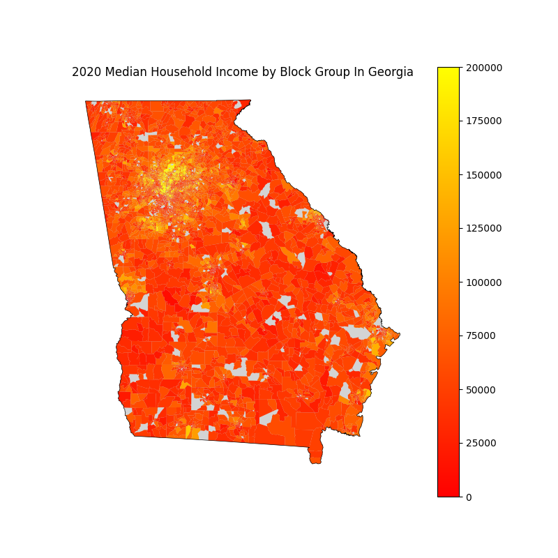
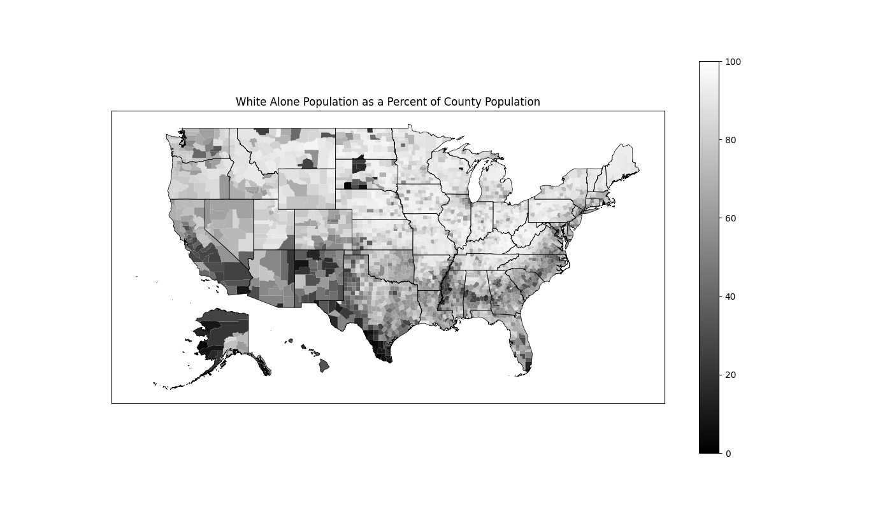
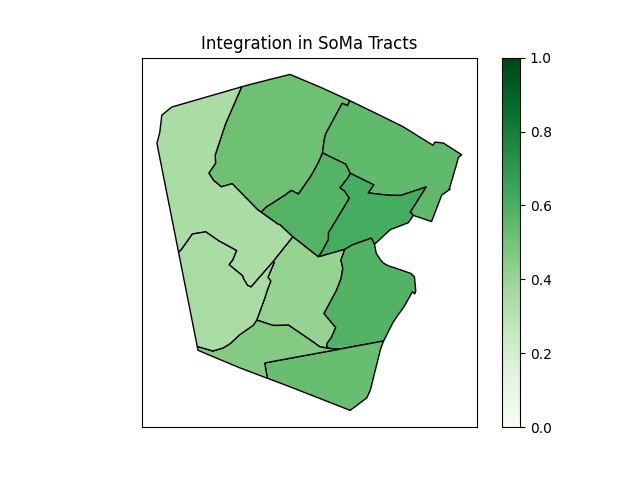

# censusdis

[](https://firstdonoharm.dev/version/3/0/cl-eco-extr-ffd-law-mil-sv.html)

[](https://censusdis.readthedocs.io/en/latest/?badge=latest)

[](https://github.com/vengroff/censusdis/actions/workflows/lint.yml)


## Introduction 

`censusdis` is a package for discovering, loading, analyzing, and computing
diversity, integration, and segregation metrics
to U.S. Census demographic data. It is designed to be intuitive and Pythonic,
but give users access to the full collection of data and maps the US Census
publishes via their APIs. 

> ### I'm sold! I want to dive right in!
> 
> To get straight to installing and trying out
> code hop over to our 
> [Getting Started](https://censusdis.readthedocs.io/en/latest/intro.html)
> guide.

`censusdis` lets you quickly and easily load US Census data and make plots like 
this one:



We downloaded the data behind this plot, including
the geometry of all the block groups, with a
single call

```python
import censusdis.data as ced

# This is a census variable for median household income.
# See https://api.census.gov/data/2020/acs/acs5/variables/B19013_001E.html
MEDIAN_HOUSEHOLD_INCOME_VARIABLE = "B19013_001E"

gdf_bg = ced.download_detail(
    "acs/acs5",  # The American Community Survey 5-Year Data
    2020, 
    ["NAME", MEDIAN_HOUSEHOLD_INCOME_VARIABLE], 
    state=STATE_GA, 
    block_group="*", 
    with_geometry=True
)
```

Similarly, we can download data and geographies, do a little
analysis on our own using familiar [Pandas](https://pandas.pydata.org/)
data frame operations, and plot graphs like these




## Modules

The modules that make up the `censusdis` package are

| Module                | Description                                                                                                   |
|-----------------------|:--------------------------------------------------------------------------------------------------------------|
| `censusdis.geography` | Code for managing geography hierarchies in which census data is organized.                                    | 
| `censusdis.data`      | Code for fetching data from the US Census API, including managing datasets, groups, and variable hierarchies. |
| `censusdis.maps`      | Code for downloading map data from the US, caching it locally, and using it to render maps.                   |
| `censusdis.states`    | Constants defining the US States. Used by the three other modules.                                            |

## Demonstration Notebooks

There are several demonstration notebooks available to illustrate how `censusdis` can
be used. They are found in the 
[notebook](https://github.com/vengroff/censusdis/tree/main/notebooks) 
directory of the source code.

The demo notebooks include

| Notebook Name                                                                                                      | Description                                                                                                                                                                          |
|--------------------------------------------------------------------------------------------------------------------|:-------------------------------------------------------------------------------------------------------------------------------------------------------------------------------------|
| [ACS Demo.ipynb](./notebooks/ACS%20Demo.ipynb)                                                                     | Load American Community Survey (ACS) data for New Jersey and plot diversity statewide at the census block group level.                                                               |
| [Data With Geometry.ipynb](./notebooks/Data%20With%Geometry.ipynb)                                                 | Load American Community Survey (ACS) data for New Jersey and plot diversity statewide at the census block group level.                                                               |
| [Exploring Variables.ipynb](https://github.com/vengroff/censusdis/blob/main/notebooks/Exploring%20Variables.ipynb) | Load metatdata on a group of variables, visualize the tree hierarchy of variables in the group, and load data from the leaves of the tree.                                           |
| [Map Demo.ipynb](https://github.com/vengroff/censusdis/blob/main/notebooks/Map%20Demo.ipynb)                       | Demonstrate loading at plotting maps of New Jersey at different geographic granularity.                                                                                              |
| [Map Geographies.ipynb](https://github.com/vengroff/censusdis/blob/main/notebooks/Map%20Geographies.ipynb)         | Illustrates a large number of different map geogpraphies and how to load them.                                                                                                       |
| [PUMS Demo.ipynb](https://github.com/vengroff/censusdis/blob/main/notebooks/PUMS%20Demo.ipynb)                     | Load Public-Use Microdata Samples (PUMS) data for Massachusetts and plot it.                                                                                                         |
| [Seeing White.ipynb](https://github.com/vengroff/censusdis/blob/main/notebooks/Seeing%20White.ipynb)               | Load nationwide demographic data at the county level and plot of map of the US showing the percent of the population who identify as white only (no other race) at the county level. | 
| [SoMa DIS Demo.ipynb](https://github.com/vengroff/censusdis/blob/main/notebooks/SoMa%20DIS%20Demo.ipynb)           | Load race and ethnicity data for two towns in Essex County, NJ and compute diversity and integration metrics.                                                                        |

## Diversity and Integration Metrics

Diversity and integration metrics from the `divintseg` package are 
demonstrated in some notebooks.

For more information on these metrics
see the [divintseg](https://github.com/vengroff/divintseg/) 
project.

