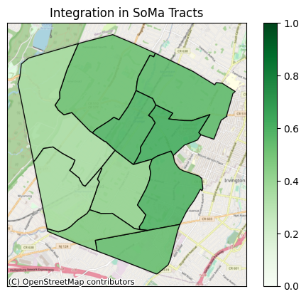
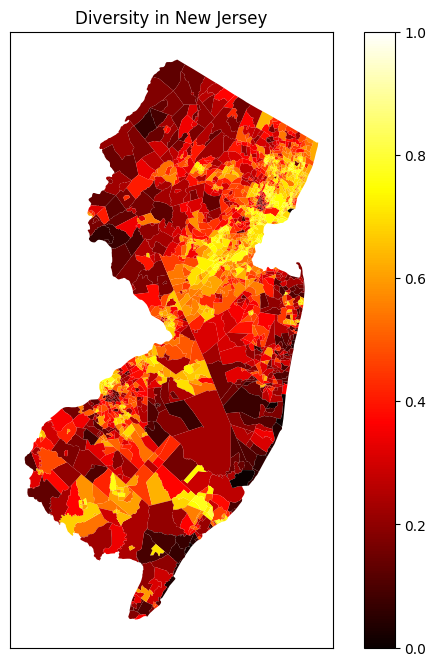
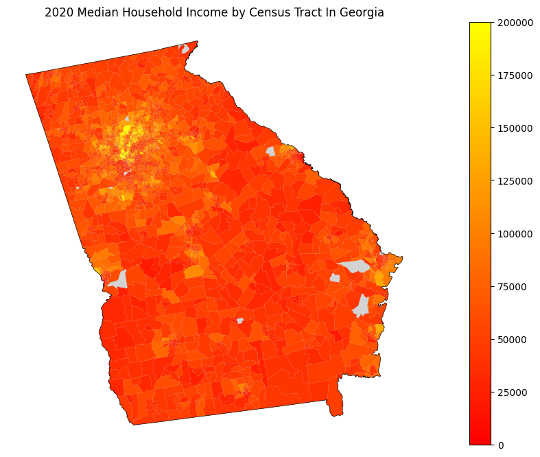
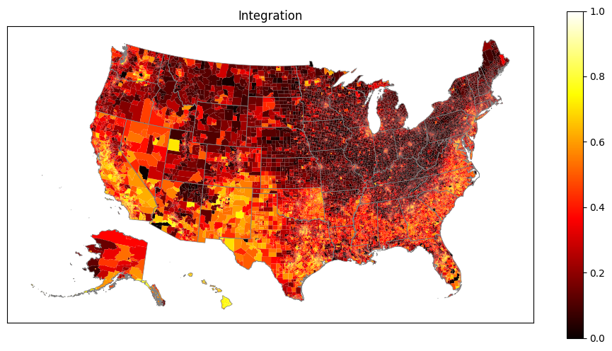
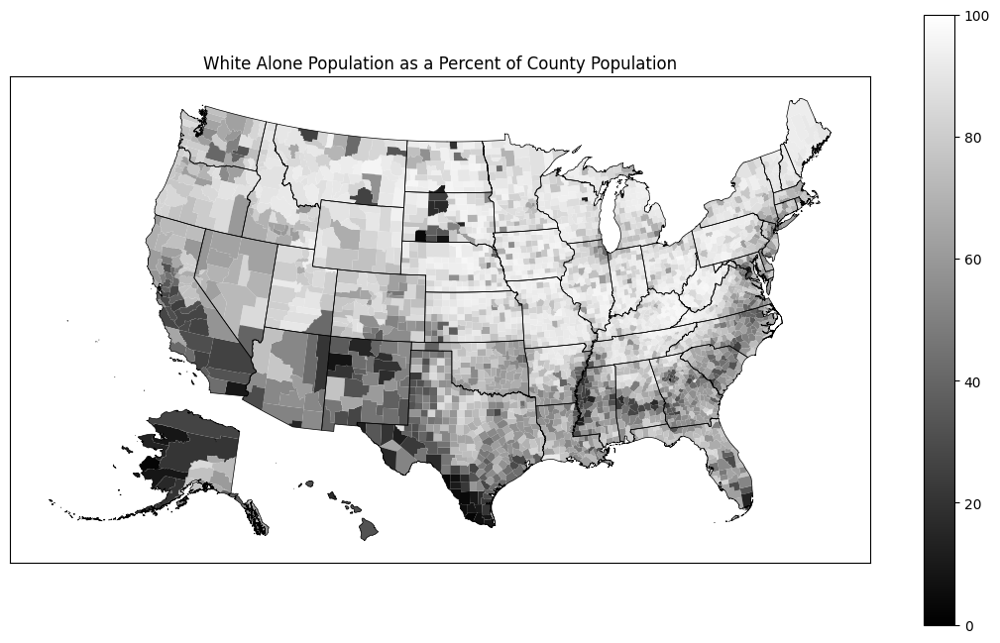
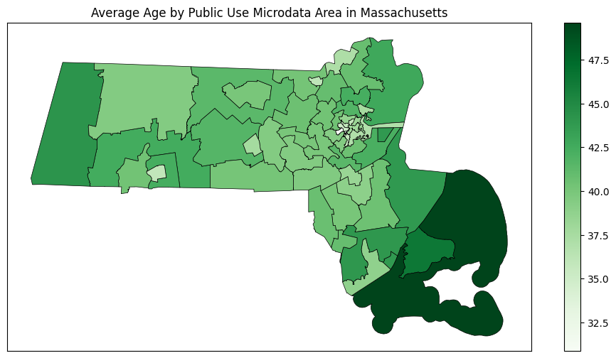

# censusdis

[](https://firstdonoharm.dev/version/3/0/cl-eco-extr-ffd-law-mil-sv.html)
[](https://censusdis.readthedocs.io/en/latest/?badge=latest)


Click any of the thumbnails below to see the notebook
that generated it.

[](notebooks/SoMa%20DIS%20Demo.ipynb)
[](notebooks/Data%20With%20Geometry.ipynb)
[](notebooks/Data%20With%20Geometry.ipynb)
[](notebooks/Nationwide%20Diversity%20and%20Integration.ipynb)
[](notebooks/Seeing%20White.ipynb)
[](notebooks/PUMS%20Demo.ipynb)

## Introduction 

`censusdis` is a package for discovering, loading, analyzing, and computing
diversity, integration, and segregation metrics
to U.S. Census demographic data. It is designed to be intuitive and Pythonic,
but give users access to the full collection of data and maps the US Census
publishes via their APIs. It also avoids hard-coding metadata
about U.S. Census variables, such as their names, types, and
hierarchies in groups. Instead, it queries this from the 
U.S. Census API. This allows it to operate over a large set
of datasets and years, likely including many that don't
exist as of time of this writing. It also integrates
downloading and merging the geometry of geographic 
geometries to make plotting data and derived metrics simple
and easy. Finally, it interacts with the `divintseg`
package to compute diversity and integration metrics.

The design goal of `censusdis` are discussed in more
detail in [design-goals.md](./design-goals.md).

> ### I'm not sure I get it. Show me what it can do.
> 
> The [Nationwide Diversity and Integration](./notebooks/Nationwide%20Diversity%20and%20Integration.ipynb)
> notebook demonstrates how we can download, process, and 
> plot a large amount of US Census demographic data quickly
> and easily to produce compelling results with just a few
> lines of code.

> ### I'm sold! I want to dive right in!
> 
> To get straight to installing and trying out
> code hop over to our 
> [Getting Started](https://censusdis.readthedocs.io/en/latest/intro.html)
> guide.

`censusdis` lets you quickly and easily load US Census data and make plots like 
this one:


We downloaded the data behind this plot, including
the geometry of all the block groups, with a
single call:

```python
import censusdis.data as ced
from censusdis.states import STATE_GA

# This is a census variable for median household income.
# See https://api.census.gov/data/2020/acs/acs5/variables/B19013_001E.html
MEDIAN_HOUSEHOLD_INCOME_VARIABLE = "B19013_001E"

gdf_bg = ced.download(
    "acs/acs5",  # The American Community Survey 5-Year Data
    2020,
    ["NAME", MEDIAN_HOUSEHOLD_INCOME_VARIABLE],
    state=STATE_GA,
    block_group="*",
    with_geometry=True
)
```

Similarly, we can download data and geographies, do a little
analysis on our own using familiar [Pandas](https://pandas.pydata.org/)
data frame operations, and plot graphs like these


## Modules

The public modules that make up the `censusdis` package are

| Module                | Description                                                                                                   |
|-----------------------|:--------------------------------------------------------------------------------------------------------------|
| `censusdis.geography` | Code for managing geography hierarchies in which census data is organized.                                    | 
| `censusdis.data`      | Code for fetching data from the US Census API, including managing datasets, groups, and variable hierarchies. |
| `censusdis.maps`      | Code for downloading map data from the US, caching it locally, and using it to render maps.                   |
| `censusdis.states`    | Constants defining the US States. Used by the three other modules.                                            |

## Demonstration Notebooks

There are several demonstration notebooks available to illustrate how `censusdis` can
be used. They are found in the 
[notebook](https://github.com/vengroff/censusdis/tree/main/notebooks) 
directory of the source code.

The demo notebooks include

| Notebook Name                                                                                               | Description                                                                                                                                                                          |
|-------------------------------------------------------------------------------------------------------------|:-------------------------------------------------------------------------------------------------------------------------------------------------------------------------------------|
| [ACS Comparison Profile.ipynb](./notebooks/ACS%20Comparison%20Profile.ipynb)                                | Load and plot American Community Survey (ACS) Comparison Profile data at the state level.                                                                                            |
| [ACS Data Profile.ipynb](./notebooks/ACS%20Data%20Profile.ipynb)                                            | Load and plot American Community Survey (ACS) Data Profile data at the state level.                                                                                                  |
| [ACS Demo.ipynb](./notebooks/ACS%20Demo.ipynb)                                                              | Load American Community Survey (ACS) Detail Table data for New Jersey and plot diversity statewide at the census block group level.                                                  |
| [ACS Subject Table.ipynb](./notebooks/ACS%20Subject%20Table.ipynb)                                          | Load and plot American Community Survey (ACS) Subject Table data at the state level.                                                                                                 |
| [Data With Geometry.ipynb](./notebooks/Data%20With%Geometry.ipynb)                                          | Load American Community Survey (ACS) data for New Jersey and plot diversity statewide at the census block group level.                                                               |
| [Exploring Variables.ipynb](./notebooks/Exploring%20Variables.ipynb)                                        | Load metatdata on a group of variables, visualize the tree hierarchy of variables in the group, and load data from the leaves of the tree.                                           |
| [Getting Started Examples.ipynb](./notebooks/Getting%20Started%20Examples.ipynb)                            | Sample code from the [Getting Started](https://censusdis.readthedocs.io/en/latest/intro.html) guide.                                                                                 |                                                         |
| [Nationwide Diversity and Integration.ipynb](./notebooks/Nationwide%20Diversity%20and%20Integration.ipynb)  | Load nationwide demographic data, compute diversity and integration, and plot.                                                                                                       |
| [Map Demo.ipynb](./notebooks/Map%20Demo.ipynb)                                                              | Demonstrate loading at plotting maps of New Jersey at different geographic granularity.                                                                                              |
| [Map Geographies.ipynb](./notebooks/Map%20Geographies.ipynb)                                                | Illustrates a large number of different map geogpraphies and how to load them.                                                                                                       |
| [Population Change 2020-2021.ipynb](./notebooks/Population%20Change%202020-2021.ipynb)                      | Track the change in state population from 2020 to 2021 using ACS5 data.                                                                                                              |
| [PUMS Demo.ipynb](./notebooks/PUMS%20Demo.ipynb)                                                            | Load Public-Use Microdata Samples (PUMS) data for Massachusetts and plot it.                                                                                                         |
| [Seeing White.ipynb](./notebooks/Seeing%20White.ipynb)                                                      | Load nationwide demographic data at the county level and plot of map of the US showing the percent of the population who identify as white only (no other race) at the county level. | 
| [SoMa DIS Demo.ipynb](./notebooks/SoMa%20DIS%20Demo.ipynb)                                                  | Load race and ethnicity data for two towns in Essex County, NJ and compute diversity and integration metrics.                                                                        |
| [Time Series School District Poverty.ipynb](./notebooks/Time%20Series%20School%20District%20Poverty.ipynb)  | Demonstrates how to work with time series datasets, which are a little different than vintaged data sets.                                                                            |


## Diversity and Integration Metrics

Diversity and integration metrics from the `divintseg` package are 
demonstrated in some notebooks.

For more information on these metrics
see the [divintseg](https://github.com/vengroff/divintseg/) 
project.

