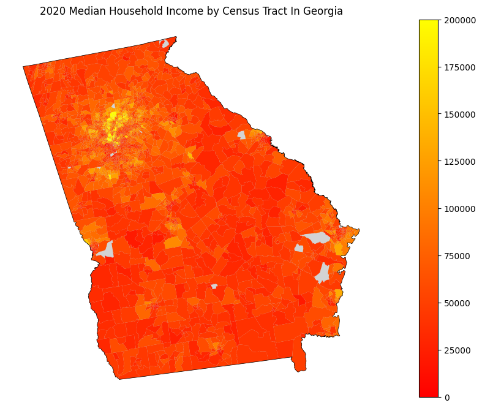
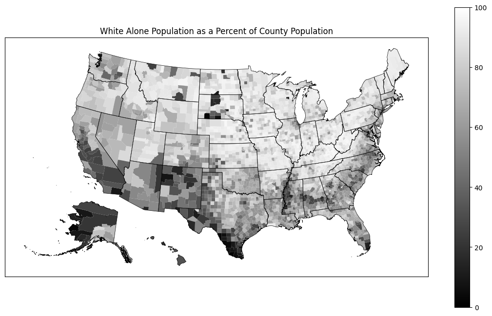

``censusdis``
=============

Click any of the thumbnails below to see the notebook
that generated it.

.. image:: _static/images/sample00.png
    :height: 160
    :alt: Integration is SoMa Tracts
    :target: nb/SoMa%20DIS%20Demo.html

.. image:: _static/images/sample01.png
    :height: 160
    :alt: Diversity in New Jersey
    :target: nb/ACS%20Demo.html

.. image:: _static/images/sample04.png
    :height: 160
    :alt: Average Age by Public Use Microdata Area in Massachusetts
    :target: nb/PUMS%20Demo.html

`censusdis` is a package for loading demographic data
from the
`US Census API <https://www.census.gov/data/developers/guidance/api-user-guide.html>`_
and maps from the
`US Census TIGER/Line Geodatabases <https://www.census.gov/geographies/mapping-files/time-series/geo/tiger-geodatabase-file.2020.html>`_
and
`US Census Cartographic Boundary Files <https://www.census.gov/geographies/mapping-files/time-series/geo/cartographic-boundary.2020.html>`_
in a unified pythonic manner. The goal is to make it
easy get the data and maps you want together in one place with
as little effort as possible. That way you can concentrate
on your research and modeling, not on wrangling and
manipulating raw census data.

The related
`divintseg <https://github.com/vengroff/divintseg>`__
project provides utilities for computing diversity,
integration, and segregation metrics from US Census and
other data.

Installation and Getting Started
--------------------------------

If you want to jump right in, see the
:ref:`getting started <getting_started>`
guide.

Sample Notebooks
----------------

If you would like to see some examples
of what ``censusdis`` can do, there are a number of `demo
notebooks <./notebooks.html>`_.

.. toctree::
   :maxdepth: 2
   :hidden:

   intro.rst
   notebooks.rst
   api.rst

Indices and Tables
==================

* :ref:`genindex`
* :ref:`modindex`
* :ref:`search`
