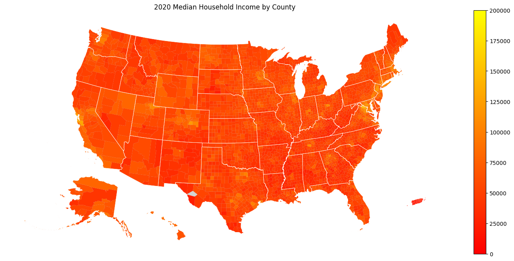

.. _getting_started:

Getting Started
===============

*N.B.* If you already have an environment with ``censusdis``
installed and prefer to jump straight to complete
demo notebooks you can find them `here <./notebooks.html>`_.

.. _installation:

Installing ``censusdis``
------------------------

Installation follows the typical model for Python::

    pip install censusdis

will install the package in your python environment.

If you are using a tool like `conda <https://docs.conda.io/en/latest/>`_
or `poetry <https://python-poetry.org/>`_ to manage
your dependencies, then you can add ``censusdis`` the
same way you would add any other dependency.

Census API Key (Optional Initially)
-----------------------------------

The Census API that ``censusdis`` calls requires the use of an API
key unless you are doing only a relatively small number of queries.
Luckily, the key is free and easy to get, and once you have one in
a file in the right place on your machine ``censusdis`` will automatically
use it with every call to the Census API.

To obtain a key, visit `this page <https://api.census.gov/data/key_signup.html>`_.
The key will be sent to you be email. It will be a long string of numbers 
and letters. Make a directory called ``.censusdis`` in your home directory,
then inside that directory create a text file called ``api_key.txt``. The file
should have just one line, and you should paste the key you got via email
into it. Once this is done, all ``censusdis`` calls to the Census API will
use this key.

Making Your First Query
-----------------------

Let's start with a simple example. We will use ``censusis.data``
to load the population and median houshold income of every state
in the country from the 2020 American Community Survey 5-Year Data.
In Census terms, the
name of dataset we want to use is
`"acs/acs5" <https://api.census.gov/data/2020/dec/pl.html>`_  and the name
of the variables we want to load are
`"B01003_001E" <https://api.census.gov/data/2020/acs/acs5/variables/B01003_001E.html>`_
and
`"B19013_001E" <https://api.census.gov/data/2020/acs/acs5/variables/B19013_001E.html>`_.
If you have worked with US Census data before you may recognize
the format of the data set and variable names. If you are new to
US Census data, don't worry. We will talk about how to discover
data sets and query metadata on available variables later.

We will import `censusdis.data` and set things up as describe above
with the following code::

    import censusdis.data as ced

    # American Community Survey 5-Year Data
    # https://www.census.gov/data/developers/data-sets/acs-5year.html
    DATASET = "acs/acs5"

    # The year we want data for.
    YEAR = 2020

    # This are the census variables for total population and median household income.
    # For more details, see
    #
    #     https://api.census.gov/data/2020/acs/acs5/variables.html,
    #     https://api.census.gov/data/2020/acs/acs5/variables/B01003_001E.html, and
    #     https://api.census.gov/data/2020/acs/acs5/variables/B19013_001E.html.
    #
    TOTAL_POPULATION_VARIABLE = "B01003_001E"
    MEDIAN_HOUSEHOLD_INCOME_VARIABLE = "B19013_001E"

    # The variables we are going to query.
    VARIABLES = ["NAME", TOTAL_POPULATION_VARIABLE, MEDIAN_HOUSEHOLD_INCOME_VARIABLE]

Once we have done that, we can make the following query to get the
data we want::

    # Get the value of our variables for every state in the
    # year we have chosen.
    df_states = ced.download(
        DATASET,
        YEAR,
        VARIABLES,
        state="*",
    )

The call
to ``ced.download`` will construct a URL in the Census API's preferred
format
(`https://api.census.gov/data/2020/acs/acs5?get=NAME,B01003_001E,B19013_001E&for=state:*
<https://api.census.gov/data/2020/acs/acs5?get=NAME,B01003_001E,B19013_001E&for=state:*>`_),
make a
request to the Census servers at that URL, parse the JSON that is
returned, and turn it into a ``pandas.DataFrame``.

``df_states`` now has the
name and population and median income of all 50 states and the District of
Columbia. The value returned into ``df_states`` is::

       STATE                  NAME  B01003_001E  B19013_001E
    0     42          Pennsylvania     12794885        63627
    1     06            California     39346023        78672
    2     54         West Virginia      1807426        48037
    3     49                  Utah      3151239        74197
    4     36              New York     19514849        71117
    5     11  District of Columbia       701974        90842
    6     02                Alaska       736990        77790
    7     12               Florida     21216924        57703
    8     45        South Carolina      5091517        54864
    9     38          North Dakota       760394        65315
    10    23                 Maine      1340825        59489
    11    13               Georgia     10516579        61224
    12    01               Alabama      4893186        52035
    13    33         New Hampshire      1355244        77923
    14    41                Oregon      4176346        65667
    15    56               Wyoming       581348        65304
    16    04               Arizona      7174064        61529
    17    22             Louisiana      4664616        50800
    18    18               Indiana      6696893        58235
    19    16                 Idaho      1754367        58915
    20    09           Connecticut      3570549        79855
    21    15                Hawaii      1420074        83173
    22    17              Illinois     12716164        68428
    23    25         Massachusetts      6873003        84385
    24    48                 Texas     28635442        63826
    25    30               Montana      1061705        56539
    26    31              Nebraska      1923826        63015
    27    39                  Ohio     11675275        58116
    28    08              Colorado      5684926        75231
    29    34            New Jersey      8885418        85245
    30    24              Maryland      6037624        87063
    31    51              Virginia      8509358        76398
    32    50               Vermont       624340        63477
    33    37        North Carolina     10386227        56642
    34    05              Arkansas      3011873        49475
    35    53            Washington      7512465        77006
    36    20                Kansas      2912619        61091
    37    40              Oklahoma      3949342        53840
    38    55             Wisconsin      5806975        63293
    39    28           Mississippi      2981835        46511
    40    29              Missouri      6124160        57290
    41    26              Michigan      9973907        59234
    42    44          Rhode Island      1057798        70305
    43    27             Minnesota      5600166        73382
    44    19                  Iowa      3150011        61836
    45    35            New Mexico      2097021        51243
    46    32                Nevada      3030281        62043
    47    10              Delaware       967679        69110
    48    72           Puerto Rico      3255642        21058
    49    21              Kentucky      4461952        52238
    50    46          South Dakota       879336        59896
    51    47             Tennessee      6772268        54833

Notice that the data frame has four columns, ``STATE``,
``NAME``, ``B01003_001E``, and ``B19013_001E``.
``NAME``, ``B01003_001E``, and ``B19013_001E`` are
what we asked for. But what about the first column, ``STATE``?
That is additional data that indicates the state
of each row, specified in terms of a
`FIPS Code <https://en.wikipedia.org/wiki/Federal_Information_Processing_Standard_state_code#FIPS_state_codes>`_.
FIPS codes are two-digit strings that the US Census
uses to identify states.

``censusdis`` returns FIPS codes like these to
you because they tend to be very useful in cases where
you might want to join this data with other data, either
from other ``censusdis`` queries or from other sources.
Joining on a FIPS code is usually more reliable and less
error-prone than joining on a string like the name of
a state. One data set might use the name "N. Carolina"
and another one might use "North Carolina", and a third
might use "NC". FIPS codes help us avoid confusion or
the need to keep mapping between them.

The states are in no particular order other than
what the underlying US Census API returned to us.
If order matters to you, you can sort the dataframe
by whatever column(s) you like, such as by the name
of the state, or by the population.

Filtering Queries
-----------------

Our first query got the population and median income
of every state.
Sometimes, especially when we are working at a smaller
level of granularity like a county, we don't want the
data for the entire country. We might want it just for
the counties of a particular state, say New Jersey.
In that case, we can specify this with additional
arguments to ``ced.download``. For example::

    from censusdis import states

    df_counties = ced.download(
        DATASET,
        YEAR,
        VARIABLES,
        state=states.NJ,
        county="*",
    )

This code is almost exactly the same as the last query
except that we changed ``state="*"`` to ``state=states.NJ``
and ``county="*"``. So instead of asking for the data aggregated
at the state level across all states, we are asking for only
the data from the state of New Jersey, aggregated at the
county level. The value returned into ``df_counties`` is::

       STATE COUNTY                           NAME  B01003_001E  B19013_001E
    0     34    003      Bergen County, New Jersey       931275       104623
    1     34    009    Cape May County, New Jersey        92701        72385
    2     34    015  Gloucester County, New Jersey       291745        89056
    3     34    021      Mercer County, New Jersey       368085        83306
    4     34    027      Morris County, New Jersey       492715       117298
    5     34    033       Salem County, New Jersey        62754        64234
    6     34    039       Union County, New Jersey       555208        82644
    7     34    001    Atlantic County, New Jersey       264650        63680
    8     34    005  Burlington County, New Jersey       446301        90329
    9     34    007      Camden County, New Jersey       506721        70957
    10    34    011  Cumberland County, New Jersey       150085        55709
    11    34    013       Essex County, New Jersey       798698        63959
    12    34    017      Hudson County, New Jersey       671923        75062
    13    34    019   Hunterdon County, New Jersey       125063       117858
    14    34    023   Middlesex County, New Jersey       825015        91731
    15    34    025    Monmouth County, New Jersey       620821       103523
    16    34    029       Ocean County, New Jersey       602018        72679
    17    34    031     Passaic County, New Jersey       502763        73562
    18    34    035    Somerset County, New Jersey       330151       116510
    19    34    037      Sussex County, New Jersey       140996        96222
    20    34    041      Warren County, New Jersey       105730        83497

Note that in this case, we received both the FIPS code for
the state (34 in New Jersey) and the county within the state,
along with the name of the county and its population. The
same county FIPS codes are reused from one state to the
next, so if we wanted to join this with data from elsewhere
we would need to join on both the state FIPS code and the
county FIPS code. Note also that joining by NAME could
get really messy. Is "Bergen CNTY, NJ" the same as
"Bergen County, New Jersey"?

Since the first two queries we did both went to the same
underlying "acs/acs5" dataset, the numbers they contain
should add up. We can verify this by seeing if the total
population of all the counties in New Jersey in the second
query is equal to the population of the state from the
first query with::

    df_counties["B01003_001E"].sum()

Sure enough, this sum is ``8885418``, exactly what we
saw in the New Jersey row of ``df_states``.

Additional Geographies
----------------------

Depending on what dataset we are querying, data may
be available at a wide variety of geographic levels.
Some, like region, are very large. In the US Census
data model, there are only four regions. Their populations
can be queried with::

    df_region = ced.download(
        DATASET,
        YEAR,
        VARIABLES,
        region="*",
    )

The result is::

      REGION              NAME  B01003_001E  B19013_001E
    0      2    Midwest Region     68219726        62054
    1      3      South Region    124605822        59816
    2      4       West Region     77726849        72464
    3      1  Northeast Region     56016911        72698

On the other hand, we can go down to very small
geographies called *block groups*. These are
small neighborhoods of just a few blocks, each of
which is typically home to
somewhere between hundreds and thousands of
people. Here is
a block group query for Essex County, NJ::

    COUNTY_ESSEX_NJ = "013" # See county query above.

    df_bg = ced.download(
        DATASET,
        YEAR,
        VARIABLES,
        state=states.NJ,
        county=COUNTY_ESSEX_NJ,
        block_group="*",
    )

The results of this are much larger than our previous
dataframes. There are 672 block groups in the county.
The results (leaving out a bunch of rows in the middle)
look like::

       STATE  COUNTY   TRACT BLOCK_GROUP                                                          NAME B01003_001E  B19013_001E
    0      34    013  000100           2      Block Group 2, Census Tract 1, Essex County, New Jersey         1826        31250
    1      34    013  000200           2      Block Group 2, Census Tract 2, Essex County, New Jersey         2156        39944
    2      34    013  000400           1      Block Group 1, Census Tract 4, Essex County, New Jersey         2121        41736
    3      34    013  000600           1      Block Group 1, Census Tract 6, Essex County, New Jersey         2363        44705
    4      34    013  000700           2      Block Group 2, Census Tract 7, Essex County, New Jersey         2321        32382
    5      34    013  000800           1      Block Group 1, Census Tract 8, Essex County, New Jersey         1811        78100
    6      34    013  000900           1      Block Group 1, Census Tract 9, Essex County, New Jersey         1066        16125
    7      34    013  001000           1     Block Group 1, Census Tract 10, Essex County, New Jersey         1305   -666666666
    8      34    013  001100           2     Block Group 2, Census Tract 11, Essex County, New Jersey         1660        69650
    9      34    013  001400           2     Block Group 2, Census Tract 14, Essex County, New Jersey         1434        54516

    ...

    662    34    013  004700           2     Block Group 2, Census Tract 47, Essex County, New Jersey         1373        53125
    663    34    013  004700           3     Block Group 3, Census Tract 47, Essex County, New Jersey         1028   -666666666
    664    34    013  004700           4     Block Group 4, Census Tract 47, Essex County, New Jersey         1253        53368
    665    34    013  004700           5     Block Group 5, Census Tract 47, Essex County, New Jersey          796        49097
    666    34    013  004801           1  Block Group 1, Census Tract 48.01, Essex County, New Jersey         1850        37619
    667    34    013  004801           2  Block Group 2, Census Tract 48.01, Essex County, New Jersey          530        58705
    668    34    013  004802           1  Block Group 1, Census Tract 48.02, Essex County, New Jersey         2130        11634
    669    34    013  004802           2  Block Group 2, Census Tract 48.02, Essex County, New Jersey          694        19919
    670    34    013  004802           3  Block Group 3, Census Tract 48.02, Essex County, New Jersey         1102        11713
    671    34    013  004900           1     Block Group 1, Census Tract 49, Essex County, New Jersey          885        28362

An interesting thing happened here. We asked for all the
block groups in the county. ``censusdis`` was smart
enough to realize that block groups are nested inside
geographies called census tracts, that are in turn nested
inside counties. In order to give us enough identifiers
to unambiguously differentiate the rows, the ``TRACT``
column was added even though we did not mention it in
our query. As you can see in the results, the block group
identifier is typically a single digit number so many rows
use the same value, but is unique within a tract. Each row
is a unique combination of state, census tract, and block
group.

One other interesting thing happened. There are two rows
where the value -666666666 was returned in the column ``B19013_001E``.
This is a special value that indicates that there was not
enough data in the survey to estimate the value accurately.
In many cases we will want to drop these rows or treat them
in a special way in our analysis.

If you want to find out what all the supported geographies
for a data set are, you can check a US Census page like
https://api.census.gov/data/2020/dec/pl/geography.html, which
is normally linked from the page describing the dataset
(https://api.census.gov/data/2020/dec/pl.html in this case).

``censusdis`` queries the same geography data that powers
these pages so that it can tell you what options are available
and how, in python, to specify them as arguments. You can
look at this information with the following code::

    import censusdis.geography as cgeo

    specs = cgeo.geo_path_snake_specs(DATASET, YEAR)

``specs`` will now contain::

    {'010': ['us'],
     '020': ['region'],
     '030': ['division'],
     '040': ['state'],
     '050': ['state', 'county'],
     '060': ['state', 'county', 'county_subdivision'],
     '067': ['state', 'county', 'county_subdivision', 'subminor_civil_division'],
     '070': ['state', 'county', 'county_subdivision', 'place_remainder_or_part'],
     '140': ['state', 'county', 'tract'],
     '150': ['state', 'county', 'tract', 'block_group'],

     ...

     '330': ['combined_statistical_area'],

     ...

     '550': ['state',
             'congressional_district',
             'american_indian_area_alaska_native_area_hawaiian_home_land_or_part'],
     '610': ['state', 'state_legislative_district_upper_chamber'],
     '612': ['state', 'state_legislative_district_upper_chamber', 'county_or_part'],
     '620': ['state', 'state_legislative_district_lower_chamber'],
     '622': ['state', 'state_legislative_district_lower_chamber', 'county_or_part'],
     '795': ['state', 'public_use_microdata_area'],
     '860': ['zip_code_tabulation_area'],
     '950': ['state', 'school_district_elementary'],
     '960': ['state', 'school_district_secondary'],
     '970': ['state', 'school_district_unified']}

mirroring what was on the web site, but in a form that
additional code can more easily digest. Note that the
queries we performed so far corresponded to geographies
``'040'``, ``'020'``, and ``150``. In all cases,
``censusdis`` chose the least specific geography that
could be matched against the keyword arguments we
provided.

We can query any of these geographies we like, using the
argument naming conventions returned in ``specs`` above.
For example::

    df_csa = ced.download(
        DATASET,
        YEAR,
        VARIABLES,
        combined_statistical_area="*"
    )

which produces the results::

        COMBINED_STATISTICAL_AREA                                                     NAME  B01003_001E  B19013_001E
    0                         104                               Albany-Schenectady, NY CSA      1169019        69275
    1                         106                   Albuquerque-Santa Fe-Las Vegas, NM CSA      1156289        55499
    2                         107                               Altoona-Huntingdon, PA CSA       167640        51497
    3                         108                            Amarillo-Pampa-Borger, TX CSA       308297        56120
    4                         118                          Appleton-Oshkosh-Neenah, WI CSA       407758        65838
    5                         120                         Asheville-Marion-Brevard, NC CSA       538785        54033
    6                         122  Atlanta--Athens-Clarke County--Sandy Springs, GA-AL CSA      6770764        68938
    7                         140                                  Bend-Prineville, OR CSA       215482        67851
    8                         142                      Birmingham-Hoover-Talladega, AL CSA      1315561        56576
    9                         144                              Bloomington-Bedford, IN CSA       213724        53695

    ...

    165                       539                                   Tupelo-Corinth, MS CSA       202909        47893
    166                       540                               Tyler-Jacksonville, TX CSA       282525        57327
    167                       544                             Victoria-Port Lavaca, TX CSA       121092        58325
    168                       545                        Virginia Beach-Norfolk, VA-NC CSA      1858942        67884
    169                       548       Washington-Baltimore-Arlington, DC-MD-VA-WV-PA CSA      9781219        95810
    170                       554            Wausau-Stevens Point-Wisconsin Rapids, WI CSA       306886        59919
    171                       556                                 Wichita-Winfield, KS CSA       674758        57808
    172                       558                          Williamsport-Lock Haven, PA CSA       152563        53990
    173                       566                             Youngstown-Warren, OH-PA CSA       640629        48251
    174                       517                              Spencer-Spirit Lake, IA CSA        33398        55762

for the 175 CSAs in the US.

More Variables
--------------

So far, we have only been looking at the variables
``NAME``, ``B01003_001E``, and ``B19013_001E`` from the
``acs/acs5``
dataset. But there are thousands of other interesting
variables in various data sets you might want to look at.

In many data sets, variables are organized into
groups. ``censusdis`` has APIs to explore groups
of related variables and load the ones you are
most interested in. There is an example in the
`SoMa DIS Demo <./nb/SoMa%20DIS%20Demo.html>`_
notebook, which looks at racial demographics and
computes diversity and integration metrics at the
census tract level.

One way to explore variables is to look at groups
of variables. We did a little bit of this in the
`SoMa DIS Demo <./nb/SoMa%20DIS%20Demo.html>`_
notebook. We do some more rigorous analysis of
groups and variables in the
`Exploring Variables <./nb/Exploring%20Variables.html>`_
notebook.

Adding Geography and Plotting
-----------------------------

All of the US Census data we queried above was organized
by geography. Often it is interesting to plot this data.
But in order to do so, we need data on the shapes and locations
of the geographical areas corresponding to each geography
represented in the data. Often this means loading the geometry
separately and then joining it together with the data.
With ``censusdis``, we don't have to do this. Instead, we
can ask it to include geometry with the data it returns
by adding the ``with_geometry=True`` flag. Here is an
example that follows up on the examples in the previous
section::

    gdf_counties = ced.download(
        DATASET,
        YEAR,
        VARIABLES,
        state="*",
        county="*",
        with_geometry=True
    )

In this example, aside from adding ``with_geometry=True``, we
passed ``state="*"`` and ``county="*"``. This means we want
data for all the counties in all the states in the country.

If we look at the return value, it looks like::

            STATE	COUNTY	                    NAME	B01003_001E	B19013_001E	                                         geometry
        0	   01	   001	 Autauga County, Alabama	      55639	      57982  POLYGON ((-86.92120 32.65754, -86.92035 32.658...
        1      01	   003	 Baldwin County, Alabama	     218289	      61756	 POLYGON ((-88.02858 30.22676, -88.02399 30.230...
        2	   01	   005	 Barbour County, Alabama	      25026	      34990	 POLYGON ((-85.74803 31.61918, -85.74544 31.618...
        3	   01	   007	    Bibb County, Alabama	      22374	      51721	 POLYGON ((-87.42194 33.00338, -87.33177 33.005...
        4 	   01	   009	  Blount County, Alabama	      57755	      48922	 POLYGON ((-86.96336 33.85822, -86.95967 33.857...
        5	   01	   011	 Bullock County, Alabama	      10173	      33866	 POLYGON ((-85.99926 32.25018, -85.98655 32.250...
        6	   01	   013	  Butler County, Alabama	      19726	      44850	 POLYGON ((-86.90894 31.96167, -86.88668 31.961...
        7	   01	   015	 Calhoun County, Alabama	     114324	      50128	 POLYGON ((-86.14623 33.70218, -86.14577 33.704...
        8	   21	   135	  Lewis County, Kentucky	      13345	      29844	 POLYGON ((-83.64418 38.63783, -83.64048 38.648...
        9	   21	   137	Lincoln County, Kentucky	      24493	      42231	 POLYGON ((-84.85792 37.48407, -84.85755 37.508...

        ...

     3220	   27	   153	  Todd County, Minnesota	      24603	      54502	 POLYGON ((-95.15557 46.36888, -95.15013 46.368...

It contains results for all 3,221 counties in the country. But in addition to
the columns we explicitly asked for and the two that identify the state and
county of each row, there is a final column called ``geometry`` that represents
the geometry of the county. The entire data frame is actually a ``GeoDataFrame``,
which is an extension of the Pandas ``DataFrame`` you are probably used to.

Now we can plot data in our geo-data frame as follows::

    import censusdis.maps as cem

    ax = cem.plot_us(
        gdf_counties,
        MEDIAN_HOUSEHOLD_INCOME_VARIABLE,
        cmap="autumn",
        legend=True,
        vmin=0.0,
        vmax=150_000,
        figsize=(12, 6)
    )

    ax.set_title(f"{YEAR} Median Household Income by County")

    ax.axis("off")

The resulting plot looks like

We used ``cem.plot_us`` because it does some nice things
for us, like relocate Alaska, Hawaii, and Puerto Rico
from their actual longitude and latitude to locations
that allow us to plot the map more compactly.
In addition to doing this relocation, ``cem.plot_is``
takes the same ``*args`` and ``**kwargs`` that
Matplotlib normally takes.

Additional Examples in Notebooks
--------------------------------

There are additional more advanced examples and
additional maps and visualizations,
presented in more `Demo Notebooks <./notebooks.html>`_.

Help and Issues
---------------

If you have questions or want to report a bug or
feature request, please contact us by opening an issue
at https://github.com/vengroff/censusdis/issues.
